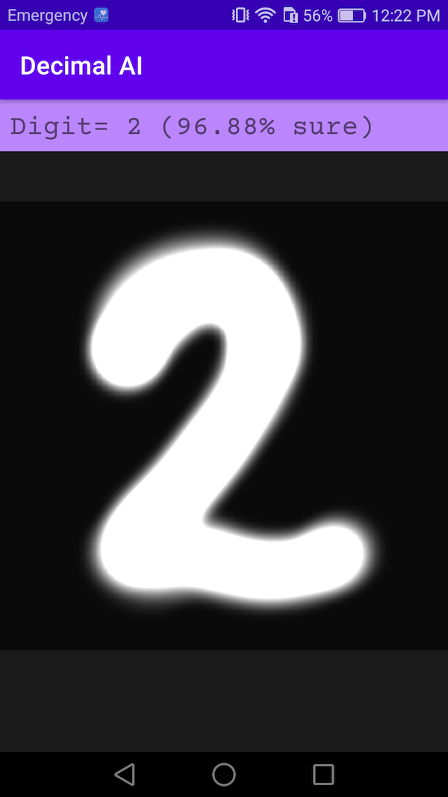

# DecimalAI

Android App that uses machine learning to recognize handwritten numbers. It uses a [previously trained Neural Network (NN)](https://josealbertocabrera.com/?project=nn-to-predict-numbers-with-numpy-keras-and-pytorch) to predict the most probable number from a set of pixels defined by the user.

## AI model

The NN was trained with a database containing 5000 handwritten digits. Each digit consists of a vector with 400 elements, obtained from images with 20x20 pixels resolution. That means that the image drawn on screen is preprocessed to match these specification. 

Since the training data was not obtained from this App, but rather from [Andrew Ng's course](https://youtube.com/playlist?list=PLLssT5z_DsK-h9vYZkQkYNWcItqhlRJLN), the results may not be accurate at times. To improve the model, the training data should be obtained from the same source used for the prediction.

As an interesting experiment, a new functionality could be added to ask hundreds of users to draw digits and then store them in a server to train a new NN with the perfect match of luminosity and color of the widget... but we'll leave that for another time.

## Widget to draw

The canvas shown on screen is a tailored GLSurfaceView with a Renderer to display the number drawn by the user. This made it really easy to preprocess the pixels and match the NN specifications. 

The widget is also wired to update the prediction shown on top of the screen in real time as the user modifies it.

## Disclaimer

This App is not intended to be used as a final product, but rather as an educational tool to learn more about machine learning. The results it shows are far from perfect, but the code gives insight into data preprocessing and the use of a neural network for a product.
